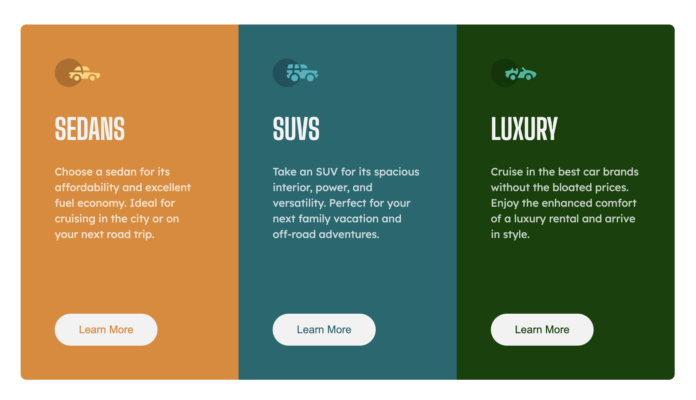

# 3-column preview card component solution

This is a solution to the [3-column preview card component challenge on Frontend Mentor](https://www.frontendmentor.io/challenges/3column-preview-card-component-pH92eAR2-).

## Table of contents

- [Overview](#overview)
  - [The challenge](#the-challenge)
  - [Screenshot](#screenshot)
  - [Links](#links)
- [My process](#my-process)
  - [Built with](#built-with)
  - [What I learned](#what-i-learned)
  - [Continued development](#continued-development)
  - [Useful resources](#useful-resources)
- [Author](#author)

## Overview

### The challenge

Users should be able to:

- View the optimal layout depending on their device's screen size
- See hover states for interactive elements

### Screenshot

### Links

- Solution URL: [Add solution URL here](https://your-solution-url.com)
- Live Site URL: [Add live site URL here](https://your-live-site-url.com)

## My process

It's my second project with desktop-first approach. It's sometimes difficult to decide what breakpoints to use in this workflow, even on something so simple like this design. But without practicing both it'll be hard in real-life projects so it's always good to practice.

### Built with

- Semantic HTML5 markup
- CSS custom properties
- Flexbox
- CSS Grid
- Desktop-first workflow

### What I learned

During this project I have some fun with CSS Grid. I definitely most often Flexbox so it was good practice. It's very useful, so I'll be practicing it more in future projects to use it with ease.

### Continued development

After this project I decided to focus more on connecting CSS Grid and CSS Flexbox. This two technologies works very well-connected together, so they should be implemented everytime where there's a need for it. Instead of choosing one, why not both, right?

### Useful resources

- [CSS Grid](https://css-tricks.com/snippets/css/complete-guide-grid/) -  CSS Tricks as always helped me refresh my memory with various things. This time it was CSS Grid.

## Author

- Github - [@PiwkoO](https://github.com/PiwkoO)
- Frontend Mentor - [@PiwkoO](https://www.frontendmentor.io/profile/PiwkoO)
